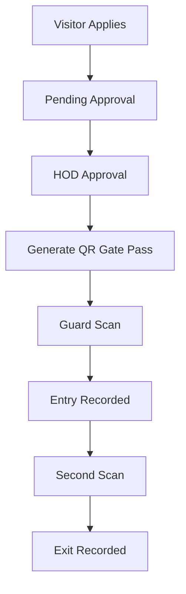

# 🚪 Visitor Gate Pass Management System


A production-inspired Visitor Gate Pass Management System built using **FastAPI**, **Firebase Firestore**, **JWT Authentication**, **Role-Based Access Control (RBAC)**, **QR Code Verification**, and **Analytics Dashboard**.

The system digitalizes the complete visitor approval process by allowing visitors to request appointments, enabling department heads (HODs) to approve or reject requests, generating secure QR-code-based gate passes, and allowing security personnel to record visitor entry and exit through QR scanning.


---
# ✨ Features

## Visitor Module
- Visitor Registration
- Online Visitor Application
- Application Status Tracking
- QR Code Gate Pass Generation

## HOD Module
- Pending Visitor Requests
- Approve / Reject Applications
- Visitor History

## Security Guard Module
- QR Code Scanner
- Automatic Entry Logging
- Automatic Exit Logging
- Recent Activity Dashboard

## Admin Module
- Employee Management
- Department Management
- Security Dashboard
- Reports & Analytics
- CSV Report Export
- PDF Report Export
- Audit Log Monitoring

---

# 🔐 Security Features

- JWT Authentication
- Session-based Authentication
- Role-Based Access Control (RBAC)
- Password Hashing using bcrypt
- Protected Admin Routes
- Protected HOD Routes
- Protected Guard Routes
- Audit Logging
- Access Logging

---

# 📊 Reports & Analytics

The Reports Dashboard provides:

- Total Visitors
- Today's Visitors
- Total Employees
- Total Departments
- Pending Applications
- Approved Applications
- Rejected Applications
- Department-wise Visitor Statistics
- Visitor Status Pie Chart
- Daily Visitor Trend Chart
- CSV Export
- PDF Export

---

# 📱 QR-Based Visitor Workflow

```text

```

---

# 🏗 System Architecture

```text
                Browser

                    │

            Jinja2 Templates

                    │

             FastAPI Routes

                    │

          Business Service Layer

                    │

          Repository Layer

                    │

          Firebase Firestore
```

---

# 📂 Project Structure

```
app/
│
├── core/
├── models/
├── repositories/
├── routes/
├── services/
├── templates/
├── static/
├── utils/
│
scripts/
│
main.py
```

---

# 🛠 Tech Stack

| Category | Technology |
|----------|------------|
| Backend | FastAPI |
| Database | Firebase Firestore |
| Authentication | JWT + Session Authentication |
| Password Hashing | bcrypt |
| QR Code | qrcode |
| PDF Reports | ReportLab |
| Charts | Chart.js |
| Templates | Jinja2 |
| Frontend | HTML, Bootstrap 5 |
| Language | Python 3.11 |

---

# 📦 Database Collections

The application stores data in the following Firestore collections:

- users
- employees
- departments
- visitor_applications
- gate_passes
- access_logs
- audit_logs

---

# 🚀 Installation

Clone the repository

```bash
git clone https://github.com/Shravan-a11y/VGP
```

Move into the project directory

```bash
cd Visitor-GatePass-System
```

Create a virtual environment

```bash
python -m venv venv
```

Activate the virtual environment

Windows

```bash
venv\Scripts\activate
```

Linux / macOS

```bash
source venv/bin/activate
```

Install dependencies

```bash
pip install -r requirements.txt
```

Run the application

```bash
uvicorn main:app --reload
```

---

# ⚙ Environment Variables

Create a `.env` file and configure the following variables:

```env
JWT_SECRET_KEY=
JWT_ALGORITHM=
ACCESS_TOKEN_EXPIRE_MINUTES=
FIREBASE_DATABASE_URL=
```

---

# 📸 Screenshots


- Visitor Application
- 

- Admin Dashboard
- 

- HOD Dashboard
- 

- Guard Dashboard
- 

- Reports Dashboard
- 

- QR Gate Pass
- 


---

# 📈 Future Improvements

- PostgreSQL Migration
- React Frontend
- Docker Support
- GitHub Actions (CI/CD)
- Automated Testing with Pytest
- Email Notifications
- Firebase Storage Integration
- Visitor Photo Verification
- Live Dashboard Updates
- REST API Versioning

---

# 📚 What I Learned

Through this project, I gained practical experience in:

- FastAPI Backend Development
- Layered Architecture (Repository-Service-Route)
- JWT Authentication
- Session-Based Authentication
- Role-Based Access Control
- Firebase Firestore Integration
- QR Code Generation
- PDF Report Generation
- Dashboard Analytics
- Audit Logging
- Clean Code Organization

---

# 👨‍💻 Author

**Shravan Deshmukh**

Electronics and Computer Science Engineering

VIT Chennai

GitHub: (https://github.com/Shravan-a11y)

LinkedIn: https://www.linkedin.com/in/shravan-deshmukh-19b196320/

---

# ⭐ If you found this project helpful, consider giving it a star!
